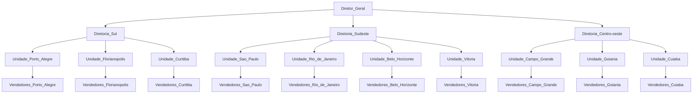

# MVP de teste: Recrutamento e Seleção - Janeiro de 2023.

## Disclaimer

As características que definem um programador entre junior/pleno/sênior não são exatas e geralmente vem mixadas tanto de capacidades técnicas como de responsabilidades e softskills, formando assim um conjunto de dados únicos de cada profissional/empresa. Um mesmo desenvolvedor pode ser considerado sênior na empresa X e pleno na empresa Y. As competências variam muito.

Esta fase do processo de seleção da **CONVICTI** visa estabelecer uma linha de referência a respeito dos conhecimentos e capacidades técnicas necessárias para o recrutamento de desenvolvedores variando de nível pleno para sênior, por isso, caso você não tenha as habilidades necessárias para desenvolvimento deste projeto ou acredite se tratar de um teste extenso, entenderemos.

## Divisão de responsabilidades

Você **NÃO** deve tentar desenvolver o sistema inteiro. Trabalhamos com divisão clara de tarefas entre Backend/Frontend e App Mobile, sendo assim, concentre-se em fazer a parte do teste que concerne à área para a qual você aplicou para a seleção. Nos itens abaixo você encontrará instruções para cada uma delas e o que esperaremos na sua entrega.

## ` -- Desenvolvedor Web Backend Pleno~Sênior `

Como **desenvolvedor backend** desse projeto, utilizando a linguagem de programação/framework/ferramentas que julgar adequadas:
* Desenvolva uma API com seus endpoints **satisfatóriamente** documentados com relação ao seu uso e retornos, atendendo as necessidades dispostas no **documento de especificação** com seus requisitos e casos de uso do projeto;
* Organize a estrutura do banco de dados para que este receba novos dados **(somente de lançamentos de vendas)** e interaja com a API desenvolvida.

  ### O que avaliaremos:
  * Entendimento e atendimento das funcionalidades descritas no *documento de especificação*;
  * Organização estrutural da base de dados;
  * Organização estrutural do código fonte do sistema;
  * Organização de commits e comentários;
  * Documentação explicativa sucinta mas eficiente de uso dos endpoints da API;
  * Documentação explicativa de preparação de ambiente de desenvolvimento (para que o próximo dev rode e continue o projeto), com utilização de docker com Dockerfile e docker-compose do projeto.
  ### Diferencial: 
  * Aplicação de design patterns, solid e clean code;
  * Utilização de testes automatizados.

## Sobre o projeto (Objetivo)

O objetivo geral do sistema é servir como ferramenta de controle regional de vendas, proporcionando uma interface onde os vendedores, através de seus celulares, possam efetuar os lançamentos das vendas.

Os gerentes por sua vez, através de seus computadores via navegador, podem acompanhar o desempenho somente de seus vendedores.

Os diretores, através de seus computadores via navegador, podem acompanhar o desempenho somente das unidades que pertencem à sua diretoria enquanto o diretor nacional pode acompanhar pelo computador via navegador o desempenho de vendas de todas as unidades e diretorias.

Uma funcionalidade MUITO IMPORTANTE é que o sistema identifica quando uma venda de um vendedor é feita em uma localização física mais próxima a uma OUTRA unidade qualquer, do que a unidade à qual o vendedor está vinculado, "tagueando" assim essa venda como "roaming".

## Hierarquia de dados (vide excel)

## Documentos anexos
Documento de Especificação: 

Dados do Projeto: 

## Observações
Este repositório será constantemente atualizado com novas informações no *documento de especificação*, incluindo respostas de perguntas feitas pelos participantes do processo seletivo bem como itens "fora do escopo" caso seja necessário.

## IMPORTANTE!
  * Este teste trata-se de modelo fictício de sistema, os códigos fontes produzidos são de propriedade dos candidatos, não sendo permitido à **CONVICTI Tecnologia** o uso do mesmos, que não para fins de avaliação do desenvolvedor. 
  * Ficam os desenvolvedores candidatos livres para usarem seus testes em seus portfólios como desejarem, sendo vedada somente a reprodução dos documentos presentes neste repositório.
  * Os desenvolvedores que completarem a entrega das funcionalidades do teste, no prazo estipulado, mas que por motivos diversos não forem contratados, poderão ser ressarcidos com um valor simbólico, referente ao tempo de trabalho para implementação do teste.
